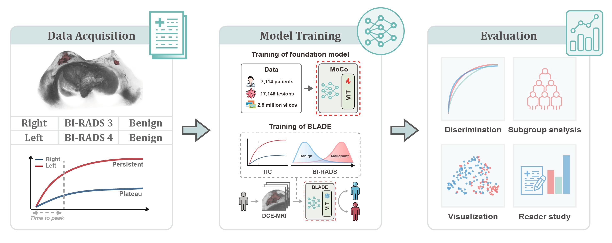

# BLADE: Breast Lesion Analysis with Domain Expertise  
This repository supports the research study **"BLADE: Breast Lesion Analysis with Domain Expertise for DCE-MRI Diagnosis"**.  
For inquiries regarding this work, please contact our team.  

## Overview  
<p align="center">
  
</p>

**Dynamic Contrast-Enhanced Magnetic Resonance Imaging (DCE-MRI)** is pivotal in breast cancer diagnosis, yet radiologists face challenges in interpreting its complex data due to the lack of robust automated tools. Current systems are limited by small datasets and insufficient integration of clinical expertise.  

**BLADE** is a novel framework that synergizes **deep learning with clinical domain knowledge** to address these gaps. It leverages:  
- A **pre-trained vertical foundation model** (trained on 2.1 million MRI slices) for robust feature extraction.  
- **Hemodynamic prior knowledge** to emulate radiologists’ diagnostic reasoning.  
- A **BI-RADS-based constraint** during training to align predictions with clinical standards.  

BLADE outperforms state-of-the-art methods in accuracy and generalizability, and serves as an effective assistive tool, **improving radiologists’ diagnostic accuracy by 14.31%**.  


## Key Contributions  
1. **Dataset & Foundation Model**:  
   - Curated **17,149 breast MRI volumes** (2.5 million slices) from global multi-center data.  
   - Pre-trained **MoCoMed**, an MRI foundation model, on 14,070 volumes (2.1 million slices) to enhance downstream task performance.  

2. **Domain-Integrated Framework**:  
   - Fuses **multi-phase DCE-MRI** information to mimic clinical time-intensity curve analysis.  
   - Introduces a **BI-RADS-aligned training constraint**, reducing false positives/negatives and improving interpretability.  

3. **Clinical Impact**:  
   - Achieves **superior performance** over SOTA methods, with strong generalization on external datasets.  
   - Boosts radiologists’ efficiency and diagnostic accuracy (**+14.31%**) when used as an assistive tool.  

## Usage

✔ **Environment Setup**  
```bash
git clone https://github.com/GDPHMediaLab/BLADE.git
cd BLADE
pip install -r requirements.txt # Python 3.9.18
```

✔ **BLADE**  
```bash
# Train
python -u main.py examples/configs/train.yaml

# Test
python -u main.py examples/configs/test.yaml
```

## Main Developers
 - [Dr. Zhenwei Shi](https://github.com/zhenweishi) <sup/>1, 2
 - [MSc. Zhitao Wei](https://github.com/kissablemt) <sup/>1, 2
 - MD. Yanting Liang <sup/>1, 2
 - MD. Zaiyi Liu <sup/>1, 2
 

<sup>1</sup> Department of Radiology, Guangdong Provincial People's Hospital (Guangdong Academy of Medical Sciences), Southern Medical University, China <br/>
<sup>2</sup> Guangdong Provincial Key Laboratory of Artificial Intelligence in Medical Image Analysis and Application, China <br/>


## Contact

🚧 *Full code release pending publication under review*  
📧 For collaboration inquiries: [Contact Email](shizhenwei@gdph.org.cn)